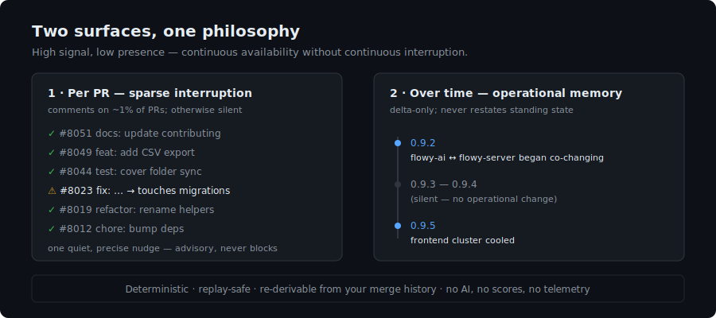
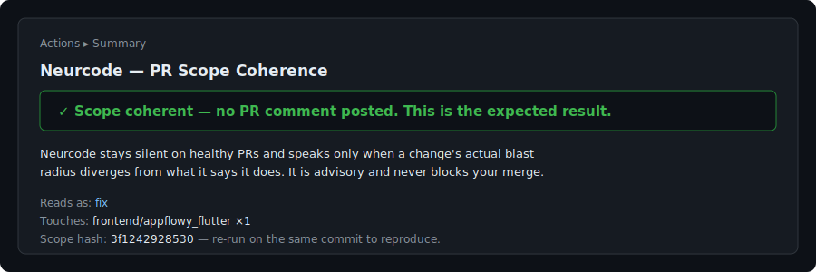
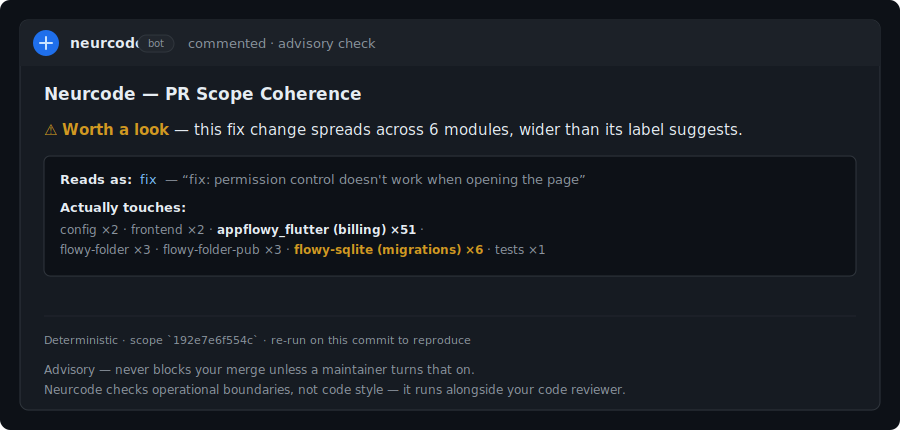
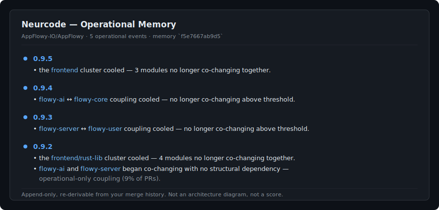

<div align="center">

# Neurcode — Repository Operational Memory

**Deterministic operational memory and observability for your repository, as a GitHub Action.**

It watches the *operational shape* of changes — what a PR touches, and how that relates to what it claims to do — and remembers how that shape evolves over time. Mostly silent. Interrupts rarely and precisely. Accumulates a deterministic, replayable operational history you consult at releases, incidents, and onboarding.

No AI prose · No scores · No dashboard · No telemetry · Same verdict on every machine.

</div>

<p align="center">
  
</p>

---

## Why keep it installed even when nothing is wrong?

Because it is building something while it stays quiet: a **deterministic record of how your repository's operational structure changes** — which modules start moving together, when a shared dependency begins co-changing across everything that depends on it, when operational pressure migrates from one area to another.

That history is not reconstructable after the fact by a code reviewer. The longer Neurcode runs, the more it can answer *"when did these two modules start changing together?"* — `git blame`, but for architecture.

The rare PR comment is the alarm. The accumulating operational memory is the product.

---

## Quick start (zero config, ~1 minute)

```yaml
# .github/workflows/neurcode.yml
name: Neurcode Scope Coherence
on:
  pull_request:
    types: [opened, synchronize, reopened]
permissions:
  contents: read
  pull-requests: write   # to post the (rare) advisory comment — nothing else
jobs:
  scope:
    runs-on: ubuntu-latest
    steps:
      - uses: actions/checkout@v4
        with: { fetch-depth: 0 }
      - uses: sujit-jaunjal/neurcode-actions@v0.2.4   # immutable tag; pin to a SHA for maximum determinism
        with:
          oss_mode: 'true'
          github_token: ${{ github.token }}
```

That's the whole setup. Runs on the local structural path (~1s, no cloud, no account, no API key). **Advisory by default — it never blocks a merge.** Rollback is deleting the file; there is no service to deprovision and no state to clean up.

---

## Surface 1 — Sparse operational interruption (per PR)

On each PR, Neurcode compares the **declared scope** (title, body, labels, linked issues) against the **actual blast radius** (which subsystems the files touch, plus sensitive boundaries like migrations and generated code).

**On a healthy PR, it posts no comment — only a Step Summary that explains the silence is expected.** In a 300-PR replay across real OSS repos it was silent on **99%**.

<p align="center"></p>

**When a change's stated scope and its real reach diverge, you get one calm, deterministic comment** — for example, a `fix:` that quietly reaches the migrations layer:

<p align="center"></p>

Push a fix and the comment updates itself to resolved. It tracks a PR across pushes (converged / fix-loop / persistent) without adding new comments.

---

## Surface 2 — Repository operational memory (pull-first)

On a schedule (or at release boundaries), `mode: memory` accumulates a **delta-only** operational history. It **never restates standing state** ("still 78 modules", "remains coherent" — that's noise, and is intentionally absent). It records only meaningful change, and writes it to your repo as `operational-memory.md` (reads like a changelog) and `operational-memory.jsonl` (git-diffable).

<p align="center"></p>

- **Coupling lifecycle** — latent → active → dormant → reactivated.
- **Pressure migration** — where the operational center of gravity moves.
- **Structural drift** — boundaries eroding or tightening; clusters forming or cooling.

It **does not** comment on PRs. You consult it; it does not interrupt you.

```yaml
# A scheduled operational-memory job (monthly — operational structure changes slowly)
on:
  schedule: [{ cron: '0 9 1 * *' }]
jobs:
  memory:
    runs-on: ubuntu-latest
    steps:
      - uses: actions/checkout@v4
        with: { fetch-depth: 0 }
      - uses: sujit-jaunjal/neurcode-actions@v0.2.4
        with:
          mode: 'memory'
          github_token: ${{ github.token }}
```

---

## Why silence is the point

A tool that comments on every PR trains you to ignore it. Neurcode is engineered to stay quiet so that the rare time it speaks, you look. Silence on a healthy PR is not the absence of a result — it *is* the result: *this change stayed within a coherent operational boundary.* Most releases produce no memory event, and that is correct. The few that do are the ones worth reading.

## Deterministic replay

Same repository state → same verdict and same operational memory, byte-for-byte, on any machine. Every artifact carries a content hash (`scope_hash`, memory hash). There is no model, no randomness, and no network in the reasoning path — a skeptical maintainer can re-run and get the identical answer, and the accumulated memory is re-derivable from your merge history. There is no database to trust or lose.

---

## Coexistence with CodeRabbit / Sonar

Neurcode is **not** a code reviewer and is designed to run *alongside* one.

|  | CodeRabbit / Sonar | Neurcode |
|---|---|---|
| Question | *"Is this code good?"* | *"Did this change stay within a coherent operational boundary — and how is the repo's structure evolving?"* |
| Scope | the diff, line by line | the repository's operational shape, over time |
| Cadence | comments on ~every PR | comments on ~1% of PRs; otherwise silent |
| Memory | per-PR, stateless | accumulating, deterministic, replayable |
| Output | review suggestions (AI) | operational deltas (deterministic templates) |

They do not overlap in content. Keep your code reviewer; add operational memory. *(This is not a criticism of CodeRabbit — it does a different job well.)*

---

## Configuration (optional, repo-native)

Drop a `.neurcode/oss.json` to tune without touching the workflow (replay-safe, lives in your repo):

```json
{
  "commentOn": "flagged",
  "failOnIncoherent": false,
  "ignorePaths": ["vendor/", "third_party/", "**/generated/**"]
}
```

- `commentOn`: `flagged` (default — silent on coherent PRs) · `always` · `never`
- `failOnIncoherent`: `false` (advisory; never blocks). Leave off for pilots.
- `ignorePaths`: generated/vendored globs to exclude from the blast radius.

## Modes

| `mode` | Surface | Cadence |
|---|---|---|
| `gate` (default, with `oss_mode: true`) | Per-PR scope coherence | per PR (sparse) |
| `memory` | Operational memory — coupling lifecycle, pressure migration, drift | scheduled / release |
| `release-report` | Release operational history (transitions, epochs) | on release |
| `cartography` | Operational geography (pressure zones, regions, corridors, latent coupling) | on demand |
| `dynamics` | Operational momentum across release eras | on demand |
| `digest` | One fused operational picture | on demand |
| `pilot` | Trust & survivability profile (silent-rate, flag-rate, FAIL-rarity) | on demand |

## Outputs (operational)

`scope_coherence_verdict` (`coherent` / `review` / `incoherent`) · `commented` · `convergence` (`clean` / `converged` / `fix-loop` / `persistent` / `unresolved`) · `declared_change_kind` · `blast_radius_subsystems` · `scope_hash` · `operational_events`.

---

## Evidence

Neurcode was replayed against real OSS history before any pilot. On **AppFlowy** (250 PRs across 23 release boundaries): **97% of PRs silent**, **19 of 23 release boundaries silent**, a coherent year-long operational memory, two fair operational findings, and reproducible hashes. Full methodology, findings, and honest limitations: [`docs/validation-appflowy.md`](docs/validation-appflowy.md).

## Docs

- [How it works](docs/how-it-works.md)
- [Operational memory](docs/operational-memory.md)
- [Configuration](docs/configuration.md)
- [AppFlowy validation report](docs/validation-appflowy.md)
- [Example workflows](examples/)

## Trust & safety

- **No telemetry, no outbound calls** on the OSS path; your code never leaves CI. See [`SECURITY.md`](SECURITY.md).
- **Advisory by default** — never blocks a merge unless a maintainer opts in.
- **Deterministic & reproducible** — re-run on the same commit to verify any verdict.
- **Rollback** — delete the workflow file. Nothing else to undo.

## Advisory pilot

The advisory pilot is available for OSS and internal repositories.

The pilot installs a single GitHub Actions workflow. It accumulates operational memory and interrupts rarely. Most PRs receive no comment — silence is expected behavior.

Rollback is one workflow file removal.

[Request an advisory pilot →](https://github.com/sujit-jaunjal/neurcode-actions/issues/new?template=request-advisory-pilot.yml)

## License

[MIT](LICENSE).
